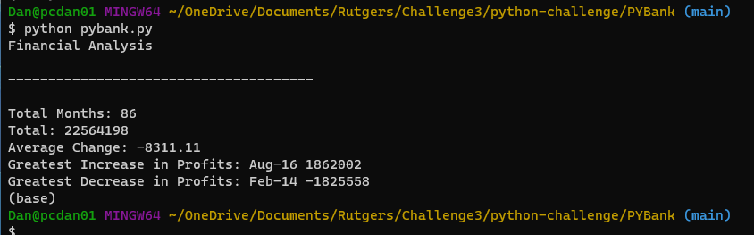
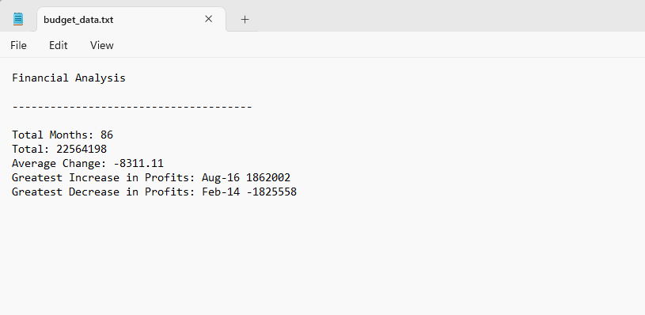

# python-challenge

In this challenge there were 2 csv files for data extraction. budget_data.csv and election_data.csv. For the first file, I was tasked with getting the total number of months as well as total amount of profit and loss for the entire period covered in the file. It was also required to get the changes in profit/loss, and then calculate the average of the changes for the same period. Then I needed to find the greates increase and the greatest decrease in profit/loss. Finally I needed to print my calculations to the bash screen as well as output the values to a separate file. I exported to a file named budget_data.txt for this exercise.

