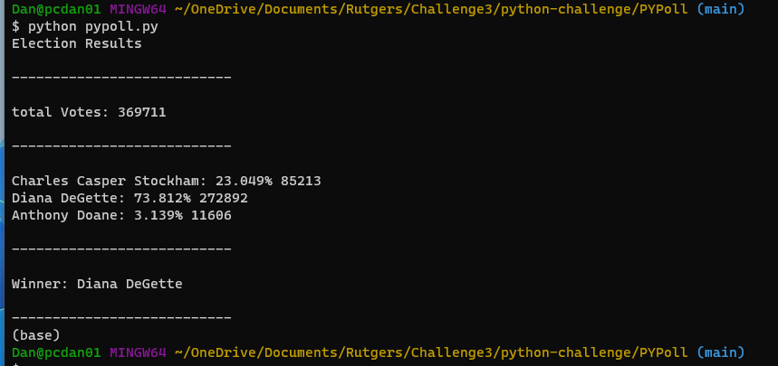
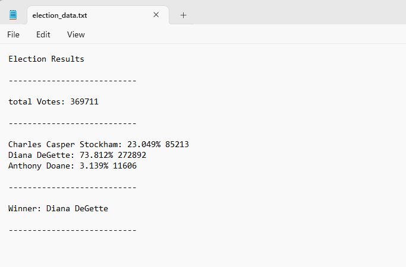

# python-challenge

In this challenge there were 2 csv files for data extraction. budget_data.csv and election_data.csv. For the first file, I was tasked with getting the total number of months as well as total amount of profit and loss for the entire period covered in the file. It was also required to get the changes in profit/loss, and then calculate the average of the changes for the same period. Then I needed to find the greatest increase and the greatest decrease in profit/loss. Finally, I needed to print my calculations to the bash screen as well as output the values to a separate file. I exported to a file named budget_data.txt for this exercise.

The second file election_data.csv I was asked to first gather a list of candidates that received votes. Then I needed to calculate the number of votes for each candidate so that I could get a percentage of votes won by the candidates as well as the display the total number of votes they received. Then I needed to use that data to determine the winner of the election. I was again asked to print my findings to the bash screen and output the data to a file. I exported to a file named election_data.txt for this exercise.

